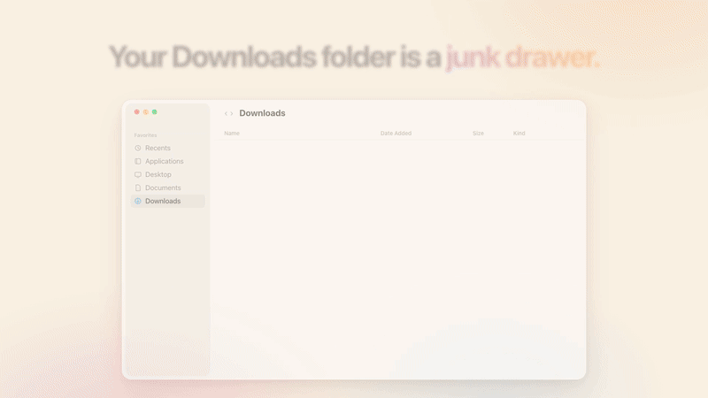

# Intake

**A native macOS Downloads organizer.** Intake tidies file names the moment a download finishes, then files them into folders on your schedule.

[](https://github.com/intelligentrascal/intake/releases/latest)
[](#requirements)
[](LICENSE)

<a href="docs/media/intake-demo.mp4"></a>

▶ [Watch the full 21-second demo with sound](docs/media/intake-demo.mp4)

---

## Why Intake

`~/Downloads` turns into a junk drawer: `quarterly-report-q1.pdf`, `Report (1).pdf`, `iPhone_setup_guide.pdf`, and a dozen installers you already used. Intake keeps it navigable without babysitting:

| Before | After |
|---|---|
| `quarterly-report-q1.pdf` | `Documents/Quarterly Report Q1.pdf` |
| `iPhone_setup_guide.pdf` | `Documents/iPhone Setup Guide.pdf` |
| `board Update deck final.pptx` | `Presentations/Board Update Deck Final.pptx` |
| `App_v2.3_Release.dmg` | `Installers/App v2.3 Release.dmg` |

## Features

- **Rename when a download finishes.** Local Title Case with small-word exceptions and a product allowlist, so `macOS`, `iPhone` and `Q1` come out right. `Report (1).pdf` becomes `Report.pdf`.
- **Wait before organizing.** New downloads stay in place for a while (2 hours by default) so you can open them before they're filed.
- **Rules you control.** Filing is based on file type by default. Rules can also match source domain, name or size, and can file into year or month subfolders. Folders are created only when a file needs one.
- **Up to five watch folders**, such as Downloads, Desktop and Screenshots, each with its own settings.
- **Organize Existing…** previews every rename and move for files already sitting in a folder. Nothing is touched until you click Organize.
- **Undo** any rename or move from Activity, a full audit trail.
- **Cleanup** finds stale files, duplicates, abandoned downloads and installers for apps you already have. Nothing is deleted without your confirmation, and deleted files go to the Trash.
- **Optional content-aware names**, such as `2026-09-14 Invoice Acme.pdf`. These are generated on your Mac with Apple's on-device model, or with OpenRouter if you choose it. Off by default.
- **Native citizen.** Dock and menu bar, a Settings window, notification digests (off by default), and support for light/dark mode and Reduce Motion.

## Install

### Requirements

- macOS 26 or later
- Apple silicon or Intel Mac that runs macOS 26

### Download

1. Get the latest notarized `Intake-x.y.z.dmg` from [**Releases**](https://github.com/intelligentrascal/intake/releases/latest).
2. Open the DMG and drag **Intake** to Applications.
3. Launch Intake and choose your Downloads folder when asked.

Builds are signed with a Developer ID and notarized by Apple, so they open without Gatekeeper workarounds. Each release lists a SHA-256 checksum:

```bash
shasum -a 256 ~/Downloads/Intake-*.dmg
```

## Getting started

After first launch, Intake runs from the **Dock** and the **menu bar**. You can hide one of them, but not both.

- **New downloads** are renamed as soon as they finish and filed after the wait time.
- **Files already in the folder** stay put until you run **Organize Existing…** from the menu bar or Settings → General.
- **Pause Organizing** in the menu bar stops filing. Renaming keeps working unless you turn it off.
- **Open Activity** shows every change, with Undo.

Files are filed into these folders inside the watch folder:

| Folder | Typical types |
|---|---|
| Documents | pdf, doc, docx, pages, txt, rtf, md |
| Spreadsheets | xls, xlsx, numbers, csv |
| Presentations | ppt, pptx, key |
| Images | png, jpg, heic, webp, gif, svg |
| Video | mp4, mov, mkv, webm |
| Audio | mp3, m4a, wav, flac |
| Archives | zip, 7z, rar, tar, gz |
| Installers | dmg, pkg |
| Other | anything unmatched |

Edit, reorder or add rules in Settings → Rules. See [docs/PRODUCT.md](docs/PRODUCT.md) for the full behavior.

## Privacy

Intake works on local files only. It makes network requests only when you turn one of these on:

- **OpenRouter** for folder suggestions (sends a file's name and your folder names) or content-aware names (sends text extracted from the file). Both are off by default, and Intake asks before file text leaves your Mac.
- **Send Feedback…**, which opens a prefilled GitHub issue in your browser.

The default content-aware naming provider, **On this Mac**, never sends file contents anywhere.

## FAQ

**Intake isn't filing my downloads.**
Check the menu bar status. Files wait out **Wait before organizing** (2 hours by default) before they're filed. **Paused** or **Automatic organizing** off also stops filing. If the folder shows **Needs access**, click **Grant Access…** in Settings → General.

**Can I get a file back where it was?**
Yes. Open Activity and click **Undo** on the rename or move.

**How do I uninstall?**
Quit Intake from the menu bar and move it from Applications to the Trash. Your files stay wherever Intake filed them. To remove its settings too, delete `~/Library/Containers/app.intake.Intake`.

## Build from source

Requires Xcode with the macOS 26 SDK.

```bash
git clone https://github.com/intelligentrascal/intake.git
cd intake
open Intake/Intake.xcodeproj    # run the Intake scheme
```

Run the core tests (renaming, rules, ingest, cleanup, undo):

```bash
swift test --package-path Intake/IntakeCore
```

After building, copy the app into `~/Applications` so Spotlight and Launch Services find a stable copy:

```bash
./scripts/install-local.sh
```

### Project layout

```text
Intake/Intake/       SwiftUI + AppKit app: menu bar, Settings, Activity, watchers
Intake/IntakeCore/   Swift package: taxonomy, rename, rules, ingest, cleanup, undo (+ tests)
docs/                PRODUCT.md (behavior) and DESIGN.md (UI guidelines)
design/              Design handoffs and icon sources
scripts/             Local install helper
```

## Contributing

Bug reports and PRs are welcome. Read [CONTRIBUTING.md](CONTRIBUTING.md) first, and use the [bug report template](https://github.com/intelligentrascal/intake/issues/new?template=bug_report.md) for issues. You can also use **Send Feedback…** inside the app.

## Security

Please report vulnerabilities privately as described in [SECURITY.md](SECURITY.md), not in public issues.

## License

[MIT](LICENSE)
